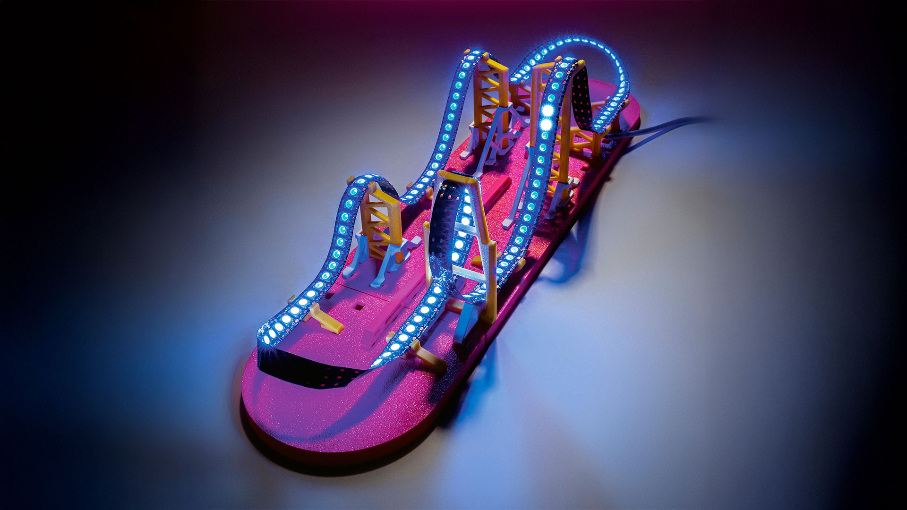

Maker Media GmbH

***

# LED-Achterbahn

**Aus einem LED-Streifen, etwas Physik und einem ESP32 entsteht eine LED-Achterbahn, bei der das Licht wie ein echter Wagen durch Loopings und Kurven rauscht. Und das zugehörige Baukastensystem macht individuelle Streckendesigns zum Kinderspiel – ganz ohne Kleben, Schrauben oder manuelle Code-Anpassungen.**



Hier findet ihr die Daten für den 3D-Druck und den Arduino-Code.

Der vollständige Artikel zum Projekt steht in der **[Make-Ausgabe 2/26](https://www.heise.de/select/make/2026/2)**.

---
# Infos aus dem FORK<>

## umgesetzte Features
- ✅ Anbindung eines DFPlayer Mini für Audio-Effekte (Theme-Song, Zonen-Sounds, Zufallswiedergabe – siehe [Sound-System](#sound-system-dfplayer-mini))

## Hinweise zu G-Kräften in Telemetrie
Die G-Kräfte glätten (Der Code-Fix)
Da die Kurve in kleine lineare Stücke (Segmente) zerhackt wird, entstehen an den "Knickpunkten" zwischen den Segmenten oft winzige, aber extreme mathematische Spitzen in der Krümmung. Zudem ist ein echter Achterbahnzug lang und verteilt solche Spitzen.

Ich habe einen Tiefpassfilter (Moving Average) in den Code eingebaut, der die G-Kräfte weichzeichnet, wie es die Dämpfung eines echten Zuges tun würde. Zusätzlich habe ich die Auflösung der Kurven erhöht (const int intSteps = 40;) um eine feinere Abstufung zu erreichen.

Im Konfig-Menü ist jetzt ein Faktor konfigurierbar, der den angezeigten Wert n% abschwächt.

# Rollercoaster LED‑Simulation
*Interaktive Achterbahn‑Physik auf einem ESP32 mit OLED‑Display, Sound und bis zu 1000 LEDs.*


---

# 📖 Inhalt
1. [Überblick](#überblick)
2. [FPS‑Hinweise & Performance](#fps-hinweise--performance-tabelle)
3. [Features](#features)
4. [Hardware](#hardware)
5. [Verdrahtung](#verdrahtung)
6. [Stromversorgung](#stromversorgung)
7. [Installation](#installation)
8. [Sound-System (DFPlayer Mini)](#sound-system-dfplayer-mini)
9. [Bedienung & Menüsteuerung](#bedienung--menüsteuerung)
10. [Streckeneditor](#streckeneditor)
11. [Telemetrie & Kirmes-Modus](#telemetrie--kirmes-modus)
12. [Physik‑System](#physik-system)
13. [Dateisystem & Slots](#dateisystem--slots)
14. [Code‑Architektur](#code-architektur)
15. [Detaillierte Code‑Erklärung](#-detaillierte-code-erklärung)
16. [Troubleshooting Sound](#troubleshooting-sound)
17. [Lizenz](#lizenz)

---

# Überblick
- **rollercoaster_finale** ist **unverändert**.
- **Meine Änderungen** sind vollständig in **rollercoaster_extra** eingeflossen. Dieses Fork erweitert die Achterbahn um detailliertere Einstellungen, eine saubere Telemetrie mit Ziel-Logik, einen Kirmes-Modus mit dynamischen Sprüchen, eine optimierte Menüführung und ein vollständiges **Sound-System** auf Basis des DFPlayer Mini.

---

# FPS‑Hinweise & Performance‑Tabelle
Da der ESP32 gleichzeitig die Physik für bis zu 1000 LEDs berechnet und ein OLED-Display via I2C ansteuert, ist das richtige Timing entscheidend. Die folgende Tabelle zeigt, wie sich die Anzahl der LEDs auf die Datenraten, die maximal sinnvollen OLED‑FPS und das subjektive Fahrgefühl auswirken.

| **Anzahl LEDs** | **Zeit LED‑Daten** | **Zeit OLED‑Daten** | **Max. empfohlene OLED‑FPS** | **Effekt auf die LED‑Bahn** |
|----------------:|-------------------:|---------------------:|------------------------------:|------------------------------|
| 100  | 3 ms  | ~25 ms | 20–30 | Absolut flüssig, Ruckler nicht wahrnehmbar |
| 200  | 6 ms  | ~25 ms | 15–20 | Absolut flüssig |
| 300  | 9 ms  | ~25 ms | 15–20 | Sehr flüssig |
| 400  | 12 ms | ~25 ms | 12–15 | Sehr flüssig |
| 500  | 15 ms | ~25 ms | 10–15 | Flüssig |
| 600  | 18 ms | ~25 ms | 10–12 | Minimales Mikroruckeln messbar, kaum sichtbar |
| 700  | 21 ms | ~25 ms | 8–10  | Sehr stabiles Fahrgefühl |
| 800  | 24 ms | ~25 ms | 8–10  | Stabiles Fahrgefühl |
| 900  | 27 ms | ~25 ms | 6–8   | Leichte Ruckler beim Display‑Update möglich |
| 1000 | 30 ms | ~25 ms | 5–8   | Guter Kompromiss aus flüssiger Bahn und Telemetrie |

*Tipp: Die Display-FPS lassen sich im "Konfig"-Menü jederzeit anpassen. Standardwert ist 4 FPS.*

*Hinweis Sound: Die DFPlayer-Ansteuerung läuft über UART2 und wird bewusst ohne ACK-Wartezeiten betrieben (`isACK=false`), damit die Physik-Schleife nicht blockiert. Sound-Befehle haben dadurch keinen messbaren Einfluss auf die LED-Performance.*

---

# Features
- LED‑Achterbahn mit realistisch berechneter Physik
- Bis zu **1000 LEDs**
- **Sound-System mit 4 Modi:** Theme-Song mit Effekt-Einwürfen (Advertise), Zufallswiedergabe, nur Theme oder nur Effekte
- OLED‑Display mit Telemetrie (Aktiv/Ziel-Logik & Top-Speed Tracking)
- Vollständiger **Streckeneditor** direkt am Gerät mit Scroll-Menüs
- Lift, Brake, Booster, Loop, Helix, Steilkurve uvm.
- Zonen lassen sich temporär deaktivieren (Enabled/Disabled)
- Kirmes-Modus mit passenden Sprüchen zum jeweiligen Fahrabschnitt
- 5 Speicher‑Slots (LittleFS) inkl. Abwärtskompatibilität
- Farbcodierung nach Geschwindigkeit (Speed-Map)
- Bezier‑Interpolation für realistische Höhenprofile

---

# Hardware
- ESP32 DevKit (Empfohlen: ESP32-S3 für bessere FPU-Performance)
- SH1106 OLED 128×64 (I2C)
- WS2812B LED‑Strip
- Rotary Encoder mit Button (KY-040)
- **DFPlayer Mini** (⚠️ **Original YX5200 dringend empfohlen** – siehe [Troubleshooting](#troubleshooting-sound))
- microSD-Karte, max. 32 GB, FAT32
- Mono-Lautsprecher 4–8 Ω, max. 3 W
- 1 kΩ Widerstand (für die RX-Leitung des DFPlayer)
- Elko 470–1000 µF (Pufferung der DFPlayer-Versorgung)
- 5V Netzteil (je nach LED‑Anzahl 5–20A)

---

# Verdrahtung

## Pinbelegung ESP32

| ESP32-Pin | verbunden mit                              |
|-----------|--------------------------------------------|
| GPIO 33   | LED-Streifen Datenleitung (DIN)            |
| GPIO 25   | Encoder CLK                                |
| GPIO 26   | Encoder DT                                 |
| GPIO 27   | Encoder Taster (SW)                        |
| GPIO 21   | OLED SDA (I2C)                             |
| GPIO 22   | OLED SCL (I2C)                             |
| GPIO 17   | DFPlayer RX (**über 1 kΩ Widerstand!**)    |
| GPIO 16   | DFPlayer TX (direkt)                       |

## Anschluss DFPlayer Mini

Modul so halten, dass der SD-Karten-Slot nach oben zeigt. Pin 1 (VCC) ist dann oben links; die linke Seite zählt von oben nach unten durch.

| DFPlayer-Pin  | verbunden mit                                      |
|---------------|-----------------------------------------------------|
| VCC (Pin 1)   | 5 V                                                 |
| RX  (Pin 2)   | ESP32 GPIO 17, **1 kΩ Widerstand in Serie**         |
| TX  (Pin 3)   | ESP32 GPIO 16 (direkt)                              |
| SPK_1 (Pin 6) | Lautsprecher +                                      |
| GND (Pin 7)   | Masse (gemeinsam mit ESP32 und Netzteil!)           |
| SPK_2 (Pin 8) | Lautsprecher −                                      |

Alle übrigen Pins (BUSY, DAC, ADKEY, IO, USB) bleiben frei. Die freien Pins der rechten Modulseite dürfen nichts berühren – ADKEY/IO lösen sonst ungewollt Wiedergabe aus.

Der 1-kΩ-Widerstand dämpft den Pegelunterschied zwischen dem 3,3-V-Signal des ESP32 und dem 5-V-Eingang des Players. Ohne ihn funktioniert die Kommunikation zwar, es entsteht aber häufig ein leises Dauerrauschen im Lautsprecher.

---

# Stromversorgung

⚠️ **Der häufigste Fehler beim Nachbau:** LED-Streifen und Sound gemeinsam am USB-Port betreiben. Die Folge sind Brummen aus dem Lautsprecher, abgehackte Sounds, Ruckler und komplette Systemabstürze, die nur ein Kaltstart behebt.

Regeln für einen stabilen Betrieb:
- **LED-Streifen zwingend an ein eigenes 5-V-Netzteil**, niemals über USB versorgen.
- Bei 1000 LEDs den Strom an **mehreren Punkten** einspeisen (Anfang, Mitte, Ende), Kabelquerschnitt mind. 1,5 mm².
- **Elko 470–1000 µF direkt an VCC/GND des DFPlayer** (Polung beachten: Minus-Streifen an GND). Puffert die Stromspitzen des 3-W-Verstärkers.
- **Alle Massen verbinden** (Netzteil, ESP32, DFPlayer, LED-Streifen), sternförmig zum Netzteil geführt – nicht als lange Kette.
- Der ESP32 selbst kann am USB bleiben (praktisch zum Flashen), der DFPlayer sollte mit eigener Zuleitung ans Netzteil.
- Nach Tests das System **10–15 Sekunden stromlos** lassen: Der Elko hält den DFPlayer sonst am Leben und alte Zustände (Loop-Modus, Lautstärke) überleben den vermeintlichen Neustart.

---

# Installation
1. Repository klonen
2. Arduino IDE öffnen (ESP32 Boardverwalter muss installiert sein)
3. Bibliotheken installieren:
   - Adafruit GFX Library
   - Adafruit SH110X
   - Adafruit NeoPixel
   - RotaryEncoder (von Matthias Hertel)
   - LittleFS (ESP32)
   - **DFRobotDFPlayerMini** (von DFRobot)
4. Taktfrequenz in der IDE auf 240 MHz stellen (für maximale Physik-Performance).
5. SD-Karte für den DFPlayer vorbereiten (siehe [Sound-System](#sound-system-dfplayer-mini)).
6. Sketch hochladen.

---

# Sound-System (DFPlayer Mini)

## SD-Karten-Struktur

- Max. 32 GB, **FAT32** formatiert (nicht exFAT – Karten über 32 GB formatiert Windows standardmäßig als exFAT!)
- Dateien **einzeln in numerischer Reihenfolge** kopieren (der Player adressiert intern nach FAT-Reihenfolge)
- Bei macOS versteckte `._`-Dateien entfernen: `dot_clean /Volumes/SD`

```
SD-Karte (Root)
├── mp3/
│   ├── 0001.mp3   Kettenlift          (Modus "Effekte")
│   ├── 0002.mp3   Booster / Launch    (Modus "Effekte")
│   ├── 0003.mp3   Bremse / Zischen    (Modus "Effekte")
│   ├── 0004.mp3   Theme-Song          (Modus "Theme+FX" und "Theme")
│   └── 0005.mp3   Welcome / Start     (Modus "Effekte", beim Fahrtbeginn)
├── ADVERT/
│   ├── 0001.mp3   Kettenlift   ┐
│   ├── 0002.mp3   Booster      ├─ identische Dateien wie /mp3/0001–0003,
│   └── 0003.mp3   Bremse       ┘  als Einwurf für Modus "Theme+FX"
└── 02/
    ├── 001.mp3    ┐
    ├── 002.mp3    ├─ beliebig viele Random-Tracks (Modus "Random"),
    └── ...        ┘  lückenlos nummeriert
```

**Namenskonventionen:**
- `/mp3` und `/ADVERT`: Dateinamen mit **vier** Ziffern (`0001.mp3`)
- Nummerierte Ordner (`02`): Ordnername **zwei** Ziffern, Dateien **drei** Ziffern (`001.mp3`)
- Der Ordnername `ADVERT` muss exakt so lauten (Großbuchstaben)

## Die vier Sound-Modi

| Modus      | Verhalten                                                          |
|------------|--------------------------------------------------------------------|
| **Theme+FX** | Theme-Song läuft in Schleife. Fährt der Wagen in eine Zone, wird der passende Effekt per **Advertise** eingeblendet – danach läuft der Theme automatisch an der unterbrochenen Stelle weiter. Verlässt der Wagen den Lift, wird dessen Sound sofort beendet (`stopAdvertise`). |
| **Random**   | Zufällige Tracks aus `/02` in Endlosschleife. Läuft komplett ununterbrochen – Zonen haben keinen Einfluss. |
| **Theme**    | Nur der Theme-Song in Schleife, keine Effekte.                    |
| **Effekte**  | Stille bei freier Fahrt; Zonen-Sounds als Einzeltracks (Lift loopt, Booster/Bremse laufen einmal aus). Beim Fahrtstart wird der Welcome-Sound gespielt, geschützt durch eine Schonfrist. |

## Technische Details
- Kommunikation über **UART2** (Hardware-Serial, 9600 Baud)
- Initialisierung mit `begin(dfpSerial, /*isACK=*/false, /*doReset=*/true)`: Der abgeschaltete ACK-Check verhindert, dass Befehle wie `stop()` die Hauptschleife blockieren; der Reset sorgt für einen definierten Startzustand. Bis zu 3 Initialisierungsversuche.
- Die Anzahl der Random-Tracks wird beim Boot per `readFileCountsInFolder()` ermittelt (doppelte Abfrage, da der erste Wert nach dem Reset unzuverlässig sein kann).
- Die Sound-Logik reagiert auf **Kategorie-Wechsel** (LIFT/BOOST/BRAKE/RIDE), nicht auf jeden Statuswechsel – "FREIE FAHRT" und "AUSROLLEN" teilen sich einen Sound, damit Tracks nicht grundlos abbrechen.
- Track-Wiederholung (Theme, Lift-Loop) läuft über den `DFPlayerPlayFinished`-Event statt über den unzuverlässigen internen Loop-Modus. Eine 300-ms-Sperre fängt doppelte Finish-Events ab.

---

# Bedienung & Menüsteuerung
Die komplette Steuerung erfolgt intuitiv über den **Drehencoder**:
- **Drehen:** Navigiert durch Listen oder ändert Werte.
- **Drücken:** Bestätigt eine Auswahl oder wechselt in die nächste Menüebene.

### Das Hauptmenü
- **ABSPIELEN:** Startet die Echtzeit-Simulation der aktuell geladenen Strecke.
- **KONFIG:** Hier lassen sich visuelle und akustische Parameter anpassen:
  - Wagen- und Bahnfarbe (inkl. Speed-Map)
  - Helligkeit für Wagen, Bahn und Zonen (Lift, Brake, Booster)
  - Wagenlänge (Anzahl der LEDs)
  - Zonen-Effekte (Aus, Statisch, Lauflicht/Pulsieren)
  - OLED FPS und Display-Modus (Telemetrie vs. Kirmes)
  - Hilfparameter (G-Factor, MaxSpeed für color-speed-map)
  - **Sound-V:** Lautstärke 0–30, mit Live-Hörprobe beim Drehen
  - **Sound:** Sound global An/Aus
  - **S-Modus:** Auswahl des Sound-Modus (Theme+FX / Random / Theme / Effekte)
- **STRECKE ANPASSEN:** Zugang zum Streckeneditor (Bearbeiten, Neu hinzufügen).
- **STRECKEN [Sx]:** Dateimanager. Zeigt den aktuell geladenen Slot (S1-S5) an.

*Hinweis: Längere Menüs (wie z.B. bei der Element-Bearbeitung oder Konfig) verfügen über einen **dynamischen Scroll-Viewport**, sodass immer 6-7 Zeilen sichtbar sind und der Cursor flüssig mitläuft.*

*Wichtig: Einstellungen werden erst beim Verlassen des KONFIG-Menüs über ZURUECK in den aktiven Slot gespeichert.*

---

# Streckeneditor
Der Editor ermöglicht es, die physikalischen Eigenschaften der Strecke direkt am LED-Band zu "zeichnen". Die Strecke besteht aus "Nodes" (Knotenpunkten).

1. **Startpunkt setzen:** Definiert die Position (LED) und die Starthöhe.
2. **Elemente hinzufügen:** Du navigierst die "grüne LED" an die gewünschte Position auf dem Streifen, stellst die Höhe ein und wählst die Art des Elements (Hill, Loop, Helix, etc.).
3. **Funktions-Zonen (Lift, Brake, Booster):** Diese speziellen Elemente benötigen weitere Parameter:
   - **Wert (Force):** m/s für Lift/Bremse oder Schubkraft für den Booster.
   - **Länge:** Wie viele LEDs lang diese Zone aktiv sein soll.
   - **Aktiv/Inaktiv:** Zonen können zu Testzwecken schnell an- oder ausgeschaltet werden, ohne sie löschen zu müssen.
4. **Endpunkt:** Schließt die Strecke ab. Das System berechnet automatisch die Bezier-Kurven und die Beschleunigungswerte für jedes Teilstück dazwischen.

---

# Telemetrie & Kirmes-Modus
Während der Fahrt liefert das OLED-Display Live-Daten. Es gibt zwei Darstellungsmodi, die im Konfig-Menü umgestellt werden können.

### Modus 0: Telemetrie (Der Nerd-Modus)
Liefert exakte Daten zur Physik-Engine:
- **Pos:** Aktuelle LED-Position des Wagens / Gesamtlänge.
- **Spd m/s:** Aktuelle Geschwindigkeit in Metern pro Sekunde, inkl. der **(max xx.x)** Anzeige für den bisherigen Top-Speed des Runs.
- **G:** Aktuelle G-Kräfte inkl. der **(max xx.x/min xx.x)** Anzeige für den bisherigen Top-Wert des Runs.
- **Status:** Zeigt an, ob der Wagen frei fährt (FREIE FAHRT), gebremst wird, auf dem Lift hängt oder geboostet wird.
- **Ziele & Zonen:**
  - `AKTIV: Elem X (Typ)`: Wird angezeigt, solange sich der Wagen *physisch innerhalb* der Länge einer Zone (z.B. eines Lifts) befindet.
  - `ZIEL: Elem Y (Typ)`: Fährt der Wagen frei, zeigt das System das nächste vorausliegende Element an.
- **LED & H:** Genaue Position und Höhe des aktuellen/nächsten Elements.

### Modus 1: Jahrmarkt Live (Der Show-Modus)
Perfekt, wenn die Bahn fertig aufgebaut ist. Zeigt nur den aktuellen Speed (inkl. Max) und präsentiert einen zufällig gewählten, dynamischen Spruch passend zur aktuellen Streckensituation (z.B. *"Zischhh... Bremsen greifen!"* oder *"Kopfueber ins Glueck! Looping in Sicht!"*). In Kombination mit dem Sound-Modus **Theme+FX** entsteht so echtes Kirmes-Feeling.

---

# Physik‑System
Das Kernstück der Simulation. Der Code unterteilt die Bezier-Interpolation der Strecke in winzige Segmente.
- **Beschleunigung:** Wird durch den Hangabtrieb ($a = g \cdot \sin(\alpha)$) in jedem Segment bestimmt.
- **Reibung & Luftwiderstand:** Wirken dynamisch gegen die Bewegungsrichtung, abhängig von der aktuellen Geschwindigkeit ($v^2$).
- **Funktionszonen:** Überschreiben die Physik. Ein Lift zwingt den Wagen auf eine konstante Geschwindigkeit, eine Bremse baut Energie ab, ein Booster addiert Beschleunigung.
- Die Berechnung erfolgt zeitbasiert (`dt = millis() - lastTime`), um die Geschwindigkeit unabhängig von der CPU-Auslastung stabil zu halten.

---

# Dateisystem & Slots
Die Strecken werden im Flash-Speicher des ESP32 via LittleFS abgelegt.
- Bis zu **5 Strecken** speicherbar (Slot 1 bis Slot 5).
- Speichert alle Nodes, Optik-Einstellungen, Helligkeiten, FPS **und die Sound-Einstellungen** (Lautstärke, An/Aus, Sound-Modus).
- **Migration / Abwärtskompatibilität:** Der Code nutzt einen `FILE_MAGIC` Header mit Versionsnummer (aktuell **V6**). Alte Strecken werden beim Laden automatisch migriert: fehlende Felder erhalten sinnvolle Standardwerte (z.B. Zonen auf aktiv, Lautstärke 20, Sound-Modus Theme+FX).
- Funktionen: Laden, Neu erstellen (löscht den RAM und beginnt bei LED 0), Neu berechnen (falls die Bezier-Kurven haken) und Löschen (entfernt die .bin Datei aus dem Flash).

---

# Code‑Architektur
- **State‑Machine (UI_STATE):** Über 40 Zustände steuern, was gerade auf dem Display gerendert wird und wie der Encoder reagiert (z.B. `ST_EDIT_NODE_FORCE`, `ST_OPTICS_SOUND_MODE` oder `ST_PLAY`).
- **Nodes (`Node`):** Die Stützpfeiler der Strecke. Enthalten Typ, Höhe und ggf. Spezialfunktionen.
- **Bezier‑Interpolation (`calculations`, `bezierCalculations`):** Generiert aus wenigen Nodes eine geschwungene, realistische Bahn.
- **Segment‑Physik (`segmentCalculations`):** Wandelt die Bezier-Punkte in physikalische Steigungen um.
- **Sound-Logik (`updateSound`, `playRandomSound`, `stopSound`):** Bildet den Fahrstatus auf Sound-Kategorien ab und steuert den DFPlayer je nach gewähltem Modus. Der `DFPlayerPlayFinished`-Event in `moveLED()` übernimmt Theme-Wiederholung, Lift-Loop und Random-Weiterschaltung.
- **Renderer:** Getrennte Ausgabe für LEDs (`moveLED`, `drawSetupLeds`, `drawColorSelection`) und das Display (vielfältige `draw...` Funktionen).

---

# 🧩 Detaillierte Code‑Erklärung

## Bibliotheken & Hardware‑Setup
Der Code nutzt:
- `Adafruit_SH1106G` → OLED‑Display (I2C)
- `Adafruit_NeoPixel` → LED‑Streifen (WS2812B)
- `RotaryEncoder` → Interrupt-basierte Encoder-Auswertung für präzises Drehen.
- `LittleFS` → Dateisystem
- `Wire` → I²C für Display
- `DFRobotDFPlayerMini` → Sound-Ausgabe über UART2 (GPIO 16/17)

## Datenstrukturen

### Node
```cpp
struct Node {
  uint16_t pos;      // Position auf dem LED-Streifen
  uint16_t height;   // "Bauhöhe" des Elements
  uint8_t  type;     // 0=Start, 1=Scheitel, 2=Ende
  uint8_t  art;      // Welches Streckenelement (Hill, Loop, Lift...)
  float    force;    // Kraft/Zielgeschwindigkeit
  uint16_t length;   // Ausdehnung des Elements in LEDs
  uint8_t  enabled;  // 1 = Aktiviert, 0 = Übersprungen
};
```

### Sound-Konstanten
```cpp
#define SND_LIFT      1    // /mp3/0001.mp3 (Modus "Effekte")
#define SND_BOOSTER   2    // /mp3/0002.mp3
#define SND_BRAKE     3    // /mp3/0003.mp3
#define SND_THEME     4    // /mp3/0004.mp3 (Modi "Theme+FX" und "Theme")
#define SND_START     5    // /mp3/0005.mp3 (Welcome im Modus "Effekte")
#define ADV_LIFT      1    // /ADVERT/0001.mp3 (Einwürfe im Modus "Theme+FX")
#define ADV_BOOSTER   2    // /ADVERT/0002.mp3
#define ADV_BRAKE     3    // /ADVERT/0003.mp3
#define RANDOM_FOLDER 2    // Ordner /02 (Modus "Random")
```

---

# Troubleshooting Sound

| Symptom | Ursache | Lösung |
|---------|---------|--------|
| "DFPlayer nicht gefunden" | RX/TX vertauscht, fehlende gemeinsame Masse oder SD-Indizierung noch nicht fertig | Leitungen kreuzen (TX→RX), alle GND verbinden, `delay(1000)` vor `begin()` |
| Ordner wird als leer gemeldet, Abspielen geht aber | Clone-Chip (z.B. GD3200B, MH2024K) – `readFileCountsInFolder()` defekt | Original YX5200 verwenden oder Track-Anzahl fest im Code hinterlegen |
| Spontanes Abspielen beim Einschalten | Clone-Chip mit Auto-Play oder freischwebende ADKEY/IO-Pins | Original verwenden; rechte Pin-Reihe freihalten |
| Brummen, das lauter wird und mit Knacken endet | Verstärker schwingt in der Boot-Phase auf verrauschter Versorgung | LED-Streifen an eigenes Netzteil, Elko an den Player, 1-kΩ-Widerstand |
| Brummen/Kratzen im Betrieb, System friert ein | LED-Streifen und Player teilen sich die USB-Versorgung | **Separates Netzteil für die LEDs** – wichtigste Einzelmaßnahme! |
| `stop()` oder andere Befehle hängen | Bibliothek wartet auf ACK-Antwort, Rückleitung (Player-TX) gestört | `begin(..., /*isACK=*/false, ...)` verwenden, TX-Leitung prüfen |
| Sounds brechen ab, neuer Track startet mitten drin | Sound-Logik reagiert auf jeden Statuswechsel | Im aktuellen Code behoben (Kategorie-Abbildung) |
| Alte Einstellungen überleben den Neustart | Elko hält den Player nach dem Ausstecken am Leben | 10–15 Sekunden stromlos lassen |

---

# Lizenz
Siehe Original-Repository / Make-Ausgabe 2/26.